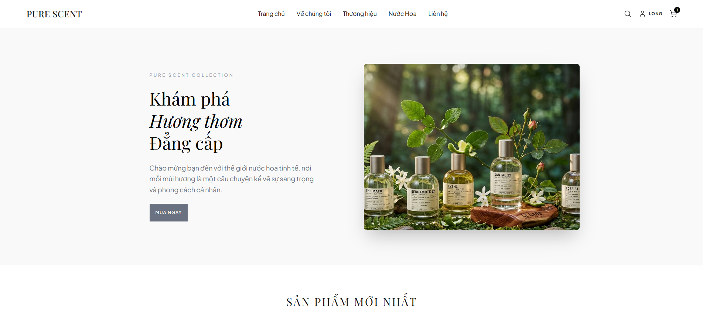
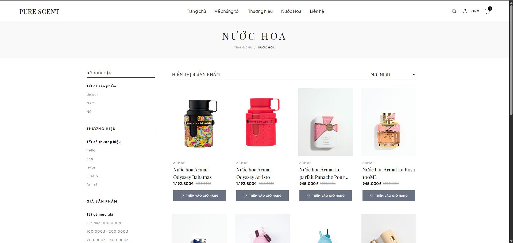
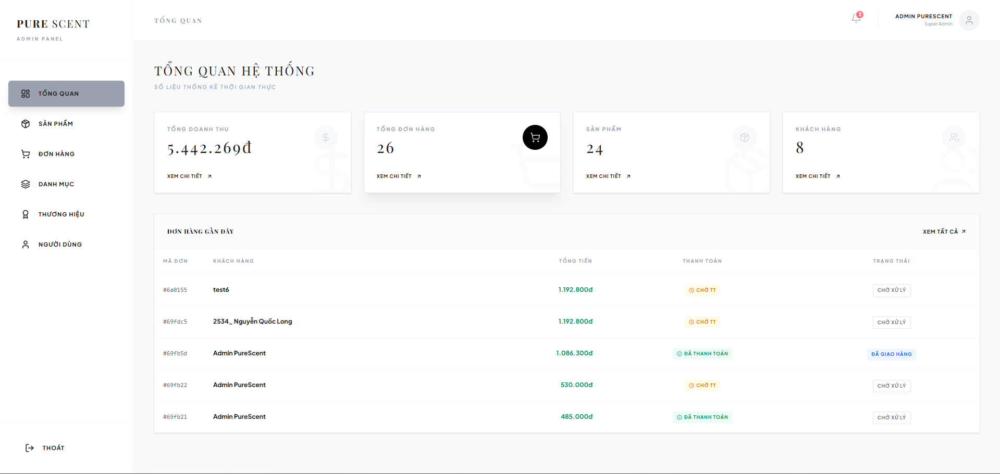
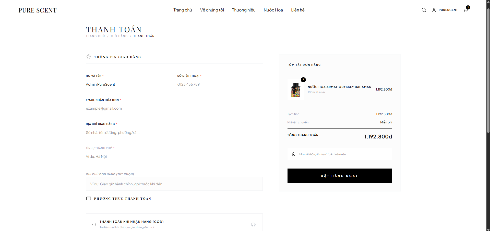

# 🌿 PureScent — Premium Perfume E-commerce Platform

A full-stack perfume e-commerce web application built with React, Node.js, Express, and MongoDB.  
PureScent provides a modern shopping experience with authentication, online ordering, admin management, and responsive UI design.

[](https://pure-scent.vercel.app)
[](https://purescent-backend.onrender.com)
[](https://mongodb.com)
[](https://github.com/Quoclongnguyen/pure_scent)

---

## 🚀 Live Demo

- Frontend: https://pure-scent.vercel.app
- Backend API: https://purescent-backend.onrender.com

---

## ✨ Key Features

### 👤 Authentication & Users
- JWT Authentication
- Google OAuth Login
- User profile management
- Order history tracking

### 🛍️ Shopping Experience
- Product listing & detail pages
- Search and filtering
- Shopping cart functionality
- Responsive UI for desktop & mobile
- Free shipping logic for eligible orders

### 💳 Payment System
- COD (Cash on Delivery)
- VietQR bank transfer integration
- Shipping form validation

### 🔧 Admin Dashboard
- Product management (CRUD)
- Category & brand management
- Order management
- User management & role-based access control (RBAC)
- Cloudinary image upload integration
- Dashboard analytics overview

---

## 🛠️ Tech Stack

### Frontend
- React 19
- React Router v7
- Tailwind CSS v4
- Axios
- Lucide React
- Sonner
- Vite

### Backend
- Node.js
- Express.js
- MongoDB Atlas
- Mongoose
- JWT Authentication
- bcryptjs
- Cloudinary
- Multer

### Deployment & Services
- Vercel
- Render
- MongoDB Atlas
- Cloudinary
- UptimeRobot

---

## 📸 Screenshots

| Home Page | Shop |
|-----------|------|
|  |  |

| Admin Dashboard | Checkout |
|-----------------|----------|
|  |  |
---

## 🏗️ Project Architecture

```bash
Frontend (React + Vite)
        ↓
REST API (Express.js)
        ↓
MongoDB Atlas
```

---

## 📁 Project Structure

```bash
pure_scent/
├── backend/
│   └── src/
│       ├── config/
│       ├── controllers/
│       ├── middleware/
│       ├── models/
│       ├── routes/
│       └── server.js
│
├── frontend/
│   └── src/
│       ├── components/
│       ├── context/
│       ├── pages/
│       ├── assets/
│       └── utils/
│
└── README.md
```

---

## ⚙️ Local Development

### Prerequisites
- Node.js >= 18
- MongoDB Atlas or Local MongoDB

---

### 1. Clone Repository

```bash
git clone https://github.com/Quoclongnguyen/pure_scent.git
cd pure_scent
```

---

### 2. Backend Setup

```bash
cd backend
npm install
```

Create `.env` file:

```env
PORT=3001
MONGODB_CONNECTIONSTRING=your_mongodb_connection
JWT_SECRET=your_jwt_secret
NODE_ENV=development
FRONTEND_URL=http://localhost:5173

GOOGLE_CLIENT_ID=your_google_client_id

CLOUDINARY_CLOUD_NAME=your_cloud_name
CLOUDINARY_API_KEY=your_api_key
CLOUDINARY_API_SECRET=your_api_secret
```

Run backend:

```bash
npm run dev
```

---

### 3. Frontend Setup

```bash
cd frontend
npm install
```

Create `.env` file:

```env
VITE_BACKEND_URL=http://localhost:3001
VITE_GOOGLE_CLIENT_ID=your_google_client_id
```

Run frontend:

```bash
npm run dev
```

---

## 🔗 API Endpoints

| Method | Endpoint | Description |
|--------|----------|-------------|
| POST | `/api/users/login` | User login |
| POST | `/api/users/register` | User registration |
| POST | `/api/users/google-login` | Google OAuth login |
| GET | `/api/products` | Get all products |
| GET | `/api/products/:id` | Get product details |
| POST | `/api/orders` | Create order |
| GET | `/api/orders/myorders` | Get user orders |

---

## 📚 What I Learned

- Building a full-stack MERN application
- Implementing JWT authentication & RBAC
- Managing global state with React Context
- Uploading and optimizing images using Cloudinary
- Deploying frontend & backend separately
- Designing responsive e-commerce UI

---

## 🚧 Future Improvements

- Online payment gateway integration
- Product reviews & ratings
- Wishlist functionality
- Email notifications
- Advanced analytics dashboard
- Performance optimization & caching

---

## 👨‍💻 Author

**QuocLongDev**

- GitHub: https://github.com/Quoclongnguyen/pure_scent
- Live Demo: https://pure-scent.vercel.app

---

## 📄 License

This project is built for educational and portfolio purposes.